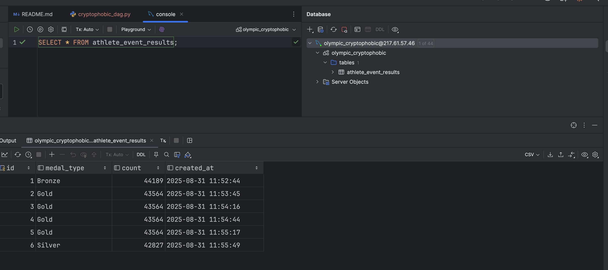

# Домашнє завдання до теми “Apache Airflow”

Було створено DAG, який:

 - створює схему та таблицю у MySQL,
 - випадково обирає тип медалі,
 - рахує кількість відповідних записів у базі та вставляє результат,
 - додає штучну затримку і перевіряє свіжість останнього запису через SqlSensor.

На скріншоті з бази даних видно, що в таблицю athlete_event_results коректно додаються рядки з медалями, кількістю та часом створення запису:

Граф DAG у Airflow підтверджує правильну побудову пайплайна з використанням BranchPythonOperator, де одночасно виконується лише одна з трьох гілок:

Run Details показує, що весь пайплайн відпрацював успішно (success), усі залежності відпрацювали, а сенсор дійсно перевірив свіжість запису:

PS: помилкові run-и не вилучив, вибачте